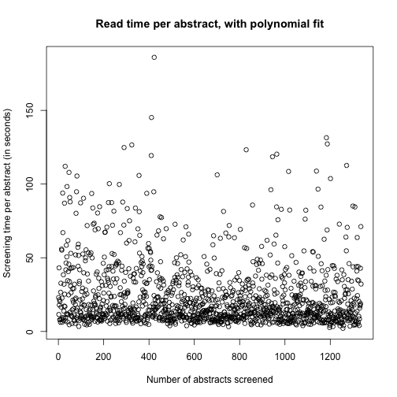

## 2. Performing a systematic review

Systematic reviews are a good source of knowledge, and are referred to often 
for clinical decision making. 

Writing a systematic review though, is not a 'light' task and takes:
- time
- effort

Putting time and effort in something is ok, but one needs to be able to plan
 their work. To do so, I've created an app that records the time spent on 
 screening an abstract. The published shiny app uses this data.

---


## 3. Setup

During the screening of some 1300 abstracts, the time used to screen was 
recorded (along with other relevant data). Reading this data into R is easy:


```r
library(data.table)
cur_wd <- getwd(); setwd("..")
screened <- read.csv("data/screening_time.csv", header = T, row.names = NULL)
colnames(screened) <- c("index", tail(colnames(screened), -1))
screened <- data.table(screened)
setwd(cur_wd)
```


---


## 4. Data exploration

Looks like the data is quite lean already.


```
##    index read_time
## 1:     1     23.03
## 2:     2     11.52
## 3:     3     43.19
## 4:     4     17.94
## 5:     5     21.50
## 6:     6      7.93
```


---


## 5. Scatter plot


Lets create a scatter plot, is there a trend? Will this help to predict how long 
the rest of the screening is going to take? To find the model that best fits 
the data, the user can alter the degree of the polynomial regression line  [here](https://vanamsterdam.shinyapps.io/abstract_sreening_time/).



```
## Error in lines(x = index, y = fit$fitted.values, col = "red", lwd = 3): object 'index' not found
```

```
## [1] 21.92132
```
